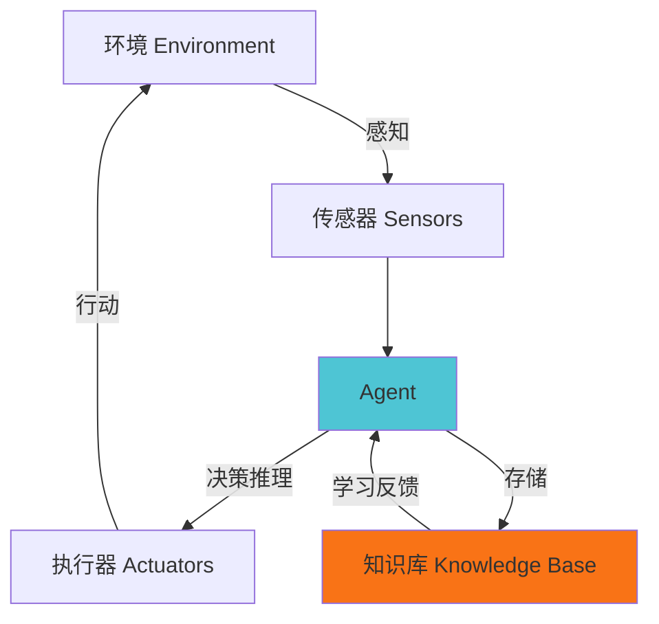
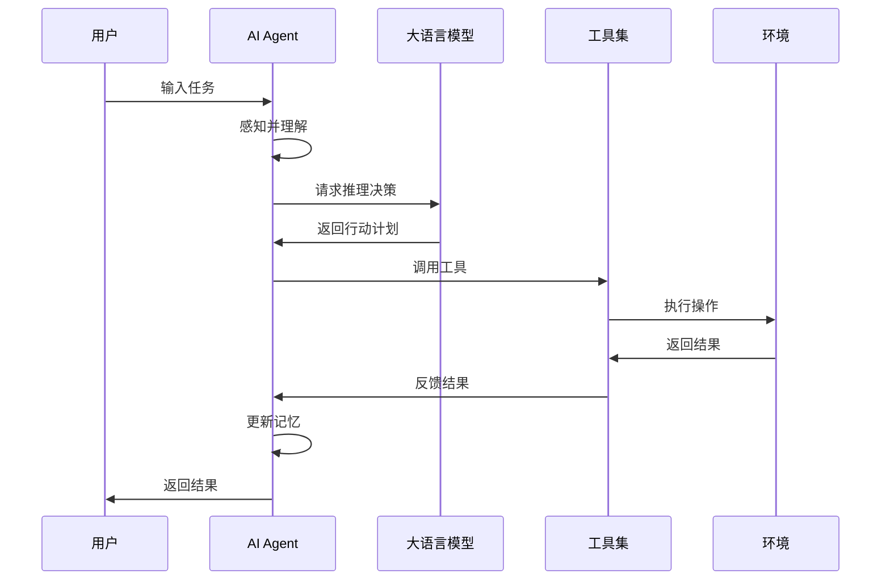

<style>
* {
  font-family: -apple-system, BlinkMacSystemFont, 'Segoe UI', 'Roboto', 'Oxygen', 'Ubuntu', 'Cantarell', sans-serif !important;
}

h1, h2, h3, h4, h5, h6 {
  font-family: -apple-system, BlinkMacSystemFont, 'Segoe UI', 'Roboto', 'Oxygen', 'Ubuntu', 'Cantarell', sans-serif !important;
  font-weight: 600;
}

body {
  background-color: #f8f9fa;
  color: #2c3e50;
}

.slidev-layout {
  background-color: #f8f9fa;
}

.slidev-slide {
  background: linear-gradient(135deg, #ffffff 0%, #f5f7fa 100%);
}
</style>

# 什么是 Agent？

AI 智能代理系统详解

<div class="pt-12">
  <span @click="$slidev.nav.next" class="px-2 py-1 rounded cursor-pointer" hover="bg-white bg-opacity-10">
    按空格键继续 <carbon:arrow-right class="inline"/>
  </span>
</div>

---

# Agent 的定义

<div class="text-lg leading-relaxed">

**Agent（智能代理）** 是一种能够感知环境、自主决策并采取行动以实现目标的智能系统。

<v-clicks>

- **感知**：通过传感器或数据接口获取环境信息
- **决策**：基于感知到的信息进行推理和规划
- **行动**：执行决策结果，与环境交互
- **学习**：从经验中改进性能

</v-clicks>

</div>

<div v-click class="mt-8 p-4 bg-blue-50 dark:bg-blue-900 rounded">
<strong>核心特征：</strong>自主性、反应性、主动性、社会性
</div>

---
layout: two-cols
---

# 传统程序 vs Agent

## 传统程序

<v-clicks>

- 遵循预定义的规则
- 被动响应输入
- 不具备学习能力
- 行为固定不变

</v-clicks>

::right::

## Agent 系统

<v-clicks>

- 自主决策行为
- 主动感知环境
- 持续学习优化
- 适应性强

</v-clicks>

<div v-click class="mt-8 text-center text-2xl text-green-600 dark:text-green-400">
Agent = 智能 + 自主 + 适应
</div>

---

# Agent 的核心组成



<v-clicks>

1. **感知模块**：获取环境状态
2. **决策模块**：分析和规划
3. **执行模块**：采取行动
4. **学习模块**：优化策略

</v-clicks>

---

# AI Agent 的类型

<div class="grid grid-cols-2 gap-4 mt-4">

<div v-click>
<h3 class="text-xl font-bold text-blue-600 dark:text-blue-400">1. 简单反射型 Agent</h3>
<ul>
<li>基于规则直接响应</li>
<li>无记忆能力</li>
<li>例：温控器、自动门</li>
</ul>
</div>

<div v-click>
<h3 class="text-xl font-bold text-green-600 dark:text-green-400">2. 基于模型的 Agent</h3>
<ul>
<li>维护环境模型</li>
<li>具有内部状态</li>
<li>例：自动驾驶系统</li>
</ul>
</div>

<div v-click>
<h3 class="text-xl font-bold text-orange-600 dark:text-orange-400">3. 目标导向型 Agent</h3>
<ul>
<li>有明确目标</li>
<li>规划行动路径</li>
<li>例：路径规划机器人</li>
</ul>
</div>

<div v-click>
<h3 class="text-xl font-bold text-red-600 dark:text-red-400">4. 效用导向型 Agent</h3>
<ul>
<li>优化效用函数</li>
<li>权衡多个目标</li>
<li>例：投资交易系统</li>
</ul>
</div>

</div>

---

# 现代 AI Agent 架构

基于大语言模型的 Agent 系统

```python
class AIAgent:
    def __init__(self):
        self.llm = LanguageModel()
        self.memory = []
        self.tools = [search, calculator, database]

    def perceive(self, input):
        context = self.memory + [input]
        return context

    def think(self, context):
        prompt = self.build_prompt(context)
        decision = self.llm.generate(prompt)
        return decision

    def act(self, decision):
        tool = self.select_tool(decision)
        result = tool.execute(decision)
        self.memory.append(result)
        return result
```

---

# AI Agent 的工作流程



---

# Agent 的关键技术

<div class="grid grid-cols-2 gap-6">

<div v-click>
<h3>1. 推理与规划</h3>
<ul>
<li>Chain of Thought (思维链)</li>
<li>ReAct (推理+行动)</li>
<li>Tree of Thoughts (思维树)</li>
</ul>
</div>

<div v-click>
<h3>2. 记忆系统</h3>
<ul>
<li>短期记忆（上下文）</li>
<li>长期记忆（向量数据库）</li>
<li>工作记忆（任务状态）</li>
</ul>
</div>

<div v-click>
<h3>3. 工具使用</h3>
<ul>
<li>API 调用</li>
<li>代码执行</li>
<li>数据库查询</li>
</ul>
</div>

<div v-click>
<h3>4. 多 Agent 协作</h3>
<ul>
<li>角色分工</li>
<li>通信协议</li>
<li>任务分配</li>
</ul>
</div>

</div>

---

# ReAct 模式示例

结合推理（Reasoning）和行动（Acting）

````md magic-move
```python
# 步骤 1: 用户提问
user_query = "北京今天的天气如何？明天适合户外运动吗？"
```

```python
# 步骤 2: Agent 思考
thought = "我需要获取北京的天气信息，然后分析是否适合户外运动"
action = "调用天气API"
```

```python
# 步骤 3: 执行行动
result = weather_api.get("北京")
# 返回: {"today": "晴天 25°C", "tomorrow": "多云 22°C"}
```

```python
# 步骤 4: 再次思考
thought = "根据天气数据，明天多云22度，适合户外运动"
action = "生成回答"
```

```python
# 步骤 5: 返回结果
response = """
北京今天天气：晴天，气温25°C
明天天气：多云，气温22°C
结论：明天天气适宜，很适合户外运动！
"""
```
````

---

# Agent 的实际应用

<div class="grid grid-cols-3 gap-4 text-sm">

<div v-click class="p-4 bg-gradient-to-br from-blue-50 to-blue-100 dark:from-blue-900 dark:to-blue-800 rounded-lg">
<h4 class="font-bold mb-2">个人助手</h4>
<ul class="text-xs">
<li>日程管理</li>
<li>邮件处理</li>
<li>信息检索</li>
<li>任务提醒</li>
</ul>
</div>

<div v-click class="p-4 bg-gradient-to-br from-green-50 to-green-100 dark:from-green-900 dark:to-green-800 rounded-lg">
<h4 class="font-bold mb-2">客户服务</h4>
<ul class="text-xs">
<li>智能客服</li>
<li>问题诊断</li>
<li>工单处理</li>
<li>用户引导</li>
</ul>
</div>

<div v-click class="p-4 bg-gradient-to-br from-orange-50 to-orange-100 dark:from-orange-900 dark:to-orange-800 rounded-lg">
<h4 class="font-bold mb-2">软件开发</h4>
<ul class="text-xs">
<li>代码生成</li>
<li>Bug 修复</li>
<li>测试编写</li>
<li>代码审查</li>
</ul>
</div>

<div v-click class="p-4 bg-gradient-to-br from-red-50 to-red-100 dark:from-red-900 dark:to-red-800 rounded-lg">
<h4 class="font-bold mb-2">数据分析</h4>
<ul class="text-xs">
<li>数据清洗</li>
<li>可视化</li>
<li>报告生成</li>
<li>趋势预测</li>
</ul>
</div>

<div v-click class="p-4 bg-gradient-to-br from-purple-50 to-purple-100 dark:from-purple-900 dark:to-purple-800 rounded-lg">
<h4 class="font-bold mb-2">业务自动化</h4>
<ul class="text-xs">
<li>流程优化</li>
<li>文档处理</li>
<li>数据录入</li>
<li>报表生成</li>
</ul>
</div>

<div v-click class="p-4 bg-gradient-to-br from-pink-50 to-pink-100 dark:from-pink-900 dark:to-pink-800 rounded-lg">
<h4 class="font-bold mb-2">游戏 NPC</h4>
<ul class="text-xs">
<li>智能对话</li>
<li>动态剧情</li>
<li>行为模拟</li>
<li>策略决策</li>
</ul>
</div>

</div>

---

# Agent 框架生态

主流的 AI Agent 开发框架

<div class="grid grid-cols-2 gap-6 mt-4">

<div v-click>

### LangChain
- 最流行的 Agent 框架
- 丰富的工具集成
- 支持多种 LLM

```python
from langchain.agents import initialize_agent
from langchain.tools import Tool

agent = initialize_agent(
    tools=[search_tool, calc_tool],
    llm=llm,
    agent="zero-shot-react"
)
```

</div>

<div v-click>

### AutoGPT
- 自主任务执行
- 长期目标规划
- 自我迭代优化

```python
autogpt = AutoGPT(
    ai_name="ResearchAgent",
    ai_role="research assistant",
    goals=["研究 AI Agent"]
)
autogpt.run()
```

</div>

</div>

---

# 构建简单的 Agent

完整示例代码

```python {all|1-5|7-10|12-20|22-28}
import openai

class SimpleAgent:
    def __init__(self, api_key):
        self.client = openai.OpenAI(api_key=api_key)
        self.messages = []

    def add_message(self, role, content):
        self.messages.append({"role": role, "content": content})

    def think(self):
        response = self.client.chat.completions.create(
            model="gpt-4",
            messages=self.messages
        )
        answer = response.choices[0].message.content
        self.add_message("assistant", answer)
        return answer

    def run(self, user_input):
        self.add_message("user", user_input)
        return self.think()

agent = SimpleAgent(api_key="your-api-key")
result = agent.run("帮我总结一下什么是 Agent")
print(result)
```

---

# Agent 的挑战与局限

<div class="grid grid-cols-2 gap-6">

<div>

### 当前挑战

<v-clicks>

1. **可靠性问题**
   - 幻觉（生成错误信息）
   - 推理链断裂
   - 工具调用失败

2. **成本与效率**
   - API 调用成本高
   - 响应时间长
   - 资源消耗大

</v-clicks>

</div>

<div>

### 安全性考虑

<v-clicks>

3. **安全风险**
   - 数据泄露
   - 恶意指令注入
   - 权限滥用

4. **伦理问题**
   - 决策透明度
   - 责任归属
   - 偏见与公平性

</v-clicks>

</div>

</div>

---

# Agent 的未来发展

<v-clicks>

## 技术趋势

- **多模态 Agent**：整合视觉、语音、文本等多种模态
- **具身智能**：Agent 与物理世界的交互能力
- **群体智能**：多 Agent 系统的协作与涌现
- **持续学习**：从交互中不断学习和进化

## 应用前景

- 更智能的个人助理
- 自动化软件工程师
- 智能决策支持系统
- 虚拟数字人

</v-clicks>

---
layout: center
class: text-center
---

# 总结

<div class="text-left max-w-2xl mx-auto mt-8">

<v-clicks>

**Agent 是什么？**
- 能够感知、决策、行动的智能系统

**核心能力**
- 自主性、推理、规划、工具使用、记忆

**关键技术**
- 大语言模型 + ReAct + 记忆系统 + 工具集成

**应用价值**
- 自动化复杂任务，提升人机协作效率

</v-clicks>

</div>

<div v-click class="mt-12 text-2xl text-blue-600 dark:text-blue-400">
Agent = 下一代人工智能应用的基础
</div>

---
layout: center
class: text-center
---

# 谢谢观看

<div class="pt-12">
  <span class="text-6xl">🤖</span>
</div>

<div class="mt-8 text-xl opacity-75">
欢迎探索 AI Agent 的无限可能
</div>
